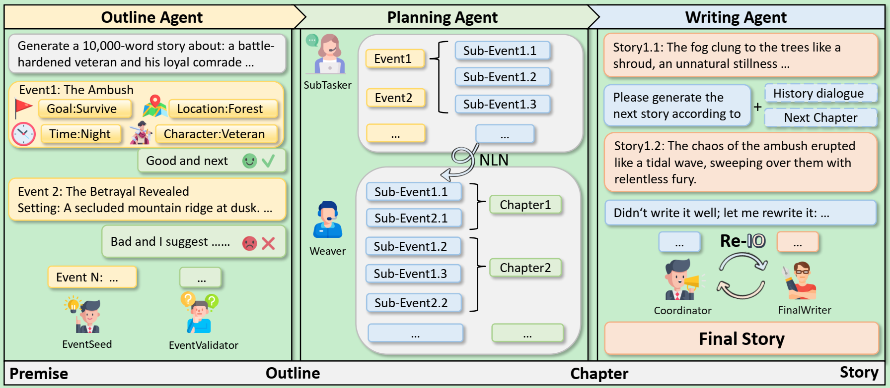

# Story Writer




This repository contains a **non-official implementation** of the [STORYWRITER: A Multi-Agent Framework for Long Story Generation](https://arxiv.org/abs/2506.16445) paper.

The implementation follows the core concept of the paper (Outline agent → Planning agent → Writing agent), but with custom modifications to the original design.

This project is **strictly for learning purposes** and should not be considered an official replication.

## Features

- ✅ **Outline Agent**: Generates high-level events and event graph
- ✅ **Planning Agent**: Decomposes events into sub-events and weaves them into a chapter-based story plan
- ✅ **Writing Agent**: Creates coherent narrative content based on the story plan

## Geting Started

### Installation

[uv](https://docs.astral.sh/uv/) is currently the most powerful Python package management tool, with fast speed and accurate dependency resolution.

Following the  [uv Official Installation Guide](https://docs.astral.sh/uv/getting-started/installation) to install uv.

```shell
$ curl -LsSf https://astral.sh/uv/install.sh | sh
```

Verify uv installation:

```shell
$ uv --version
uv 0.8.14
```

Install python dependencies

```shell
# Enter project directory
$ cd story_writer

# Use uv sync command to ensure consistency of python version and related dependency packages
$ uv sync
```

### Usage

Prepare your OpenAI-compatible Model Client.
```python
import os
from autogen_ext.models.openai import OpenAIChatCompletionClient

# Use aliyun bailian OpenAI-compatible model
model_client = OpenAIChatCompletionClient(
    model="qwen3-next-80b-a3b-instruct",    # Model list: https://help.aliyun.com/zh/model-studio/getting-started/models
    base_url="https://dashscope.aliyuncs.com/compatible-mode/v1",
    api_key=os.environ["DASHSCOPE_API_KEY"],    # Get your own API Key：https://help.aliyun.com/zh/model-studio/developer-reference/get-api-key
    model_info={
        "vision": False,
        "function_calling": True,
        "json_output": True,
        "family": "unknown",
        "structured_output": False,
    },
    temperature=0.7,
)
```

Import StoryWriter
```python
from story_writer import StoryWriter

async def main(model_client, premise: str, output_dir: str) -> None:
    story_writer = StoryWriter(model_client=model_client)
    await story_writer.write(premise=premise, output_dir=output_dir)
```

Run the pipeline
```python
import asyncio

# Story premise
premise = "A battle-hardened veteran and his loyal comrade travel through a mountain range after a failed campaign. Strange signs suggest someone betrayed them."
# Output directory
output_dir = "./output"

asyncio.run(main(model_client, premise, output_dir))
```

Generated stories will be saved in the output/ directory

```shell
$ tree output/2586a4b5-ed73-4ab7-a5b8-23cecfb334f7/
output/2586a4b5-ed73-4ab7-a5b8-23cecfb334f7/
├── chapters.json
├── outline.json
└── story_plan.json

0 directories, 3 files
```

`chapters.json`
```json
[
  {
    "chapter_id": 1,
    "title": "The Compass That Knew Too Much",
    "summary": "A non-linear opening that reveals the final, haunting truth of the compass before showing its discovery. The chapter weaves together the revelation of the compass’s true purpose with its initial discovery, creating mystery and emotional gravity from the start.",
    "sub_event_ids": [
      "E3_S4",
      "E1_S1",
      "E1_S5"
    ],
    "passages": [
      {
        "sub_event_id": "E3_S4",
        "context_snapshot": {...},
        "raw_text": "...",
        "revision_result": {...},
        "timestamp": "..."
      },
      {
        "sub_event_id": "E1_S1",
        ...
      },
      ...
    ]
  },
  {
    "chapter_id": 2,
    "title": "Signs in the Snow",
    "summary": "The encrypted signal is heard—and the horrifying realization dawns that it comes from a man presumed dead. This chapter focuses on the psychological unraveling as Elias and Rook each process the signal independently, unaware the other has already begun to suspect the truth.",
    ...
  },
  ...
]
```

see more examples in [demo/demo.ipynb](demo/demo.ipynb)
